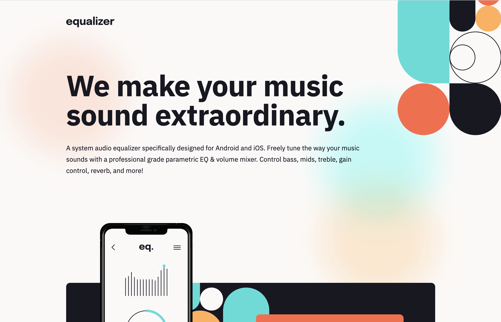

# Equalizer landing page 

## Table of contents

- [Overview](#overview)
  - [The challenge](#the-challenge)
  - [Screenshot](#screenshot)
- [My process](#my-process)
  - [Built with](#built-with)
  - [What I learned](#what-i-learned)

## Overview

### The challenge

Users should be able to:

- View the optimal layout depending on their device's screen size
- See hover states for interactive elements

### Screenshot



## My process

### Built with

- Semantic HTML5 markup
- CSS custom properties
- CSS flex

### What I learned

How to apply multiple background by css to make a better ground

```css
body {
  background: url(assets/bg-pattern-1.svg) 100% -3.5% no-repeat, var(--white) url(assets/bg-main-desktop.png) top center no-repeat;
  background-size: auto, cover;
}
```
